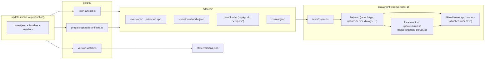

# mimiri-e2e documentation

E2E tests for the **published** Mimiri Notes desktop builds. The suite downloads a
real release artifact from `update.mimiri.io`, launches it, attaches over the
Chrome DevTools Protocol, and drives it like a user would — including real native
file dialogs and real installer machinery (Squirrel.Windows, Squirrel.Mac,
flatpak/snap).

The one constraint that shapes everything: **published builds have Node inspect
fused off**, so Playwright's `_electron.launch()` cannot be used. There is no
main-process access from tests — no dialog stubbing, no Electron API calls. See
[architecture.md](architecture.md) for how the suite works around that.

## Where to go

| Page | What it covers |
| --- | --- |
| [architecture.md](architecture.md) | How the app is launched and attached, helper layering, profile isolation per platform |
| [test-catalog.md](test-catalog.md) | Every spec file: what it protects against, how it's gated, what it does |
| [update-testing.md](update-testing.md) | The mock update server, bundle vs. shell updates, signing, the rename cascade |
| [upgrade-flows.md](upgrade-flows.md) | The release-validation matrix: real old version → real new version with seeded user state |
| [native-dialogs.md](native-dialogs.md) | Driving real file dialogs on Linux (xdotool), macOS (System Events), Windows (UIA) |
| [running-and-ci.md](running-and-ci.md) | Running locally, env vars, npm scripts, the three GitHub workflows and how they chain |
| [backlog.md](backlog.md) | Open improvement items from the fit-for-purpose review: coverage gaps, hardening, recurring upkeep |

## The big picture



Three layers:

1. **Fetch** — `npm run fetch -- canary` (or `stable`, or an explicit version)
   downloads and prepares an artifact under `artifacts/`, and records which one
   to test in `artifacts/current.json`. Nothing runs without this step.
2. **Test** — Playwright specs launch the artifact via `helpers/app.ts` and drive
   it. Update specs point the app at a **local mock** of the update host through
   env seams (`MIMIRI_UPDATE_URL` / `MIMIRI_UPDATE_KEY`, client ≥ 2.6.9), so no
   test ever touches production for updates.
3. **Watch** — `scripts/version-watch.ts` runs on a CI schedule, accumulates the
   version history the update host doesn't expose into `state/versions.json`,
   and dispatches the upgrade-validation workflow whenever a new version
   publishes.

## Repository layout

```
tests/            13 spec files (see test-catalog.md)
helpers/          launcher, UI drivers, mock update server, dialog drivers,
                  Squirrel helpers, upgrade-flow scenario model
scripts/          fetch-artifact, prepare-upgrade-artifacts, version-watch,
                  Linux dialog-session wrappers, Windows console delegation
state/            versions.json — committed watcher state (version history)
artifacts/        (gitignored) downloaded + extracted builds, bundle fixtures
.github/workflows e2e.yml, upgrade-validation.yml, version-watch.yml
```

## The two test families

- **Update mechanics** (`tests/update*.spec.ts`, smoke, signing, dialogs) — does
  the *fetched* build work: launch, render, update itself (bundle and shell),
  recover from broken state, drive native dialogs. Runs on every CI push/PR and
  nightly against canary.
- **Upgrade flows** (`tests/upgrade-flows.spec.ts`, opt-in via `UPGRADE_FLOWS=1`)
  — does a *newly published* version break **existing users**: install a real old
  release, seed notes/settings through the UI, upgrade to the new release along
  every real-world path (reinstall-over, Squirrel, package manager, bundle
  chain), and verify the state survived. Dispatched automatically by
  version-watch when a release ships.

## Sibling repositories

`../mimiri-client` (Vue renderer) and `../mimiri-client-electron` (Electron
shell) are the source of truth for `data-testid`s, menu ids and IPC names — but
they are usually **ahead** of the published build under test. Verify a testid
exists in the artifact before relying on it (extract `app.asar` with
`npx @electron/asar` and grep). Shell and bundle versions are separate streams:
shell 2.6.10 may ship bundle 2.6.5.
