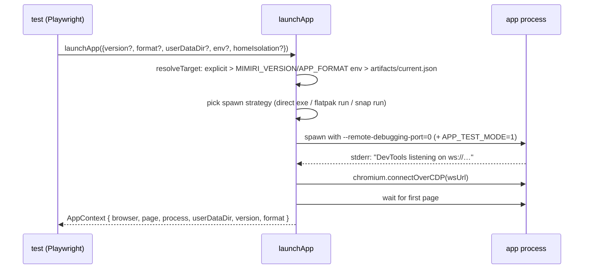
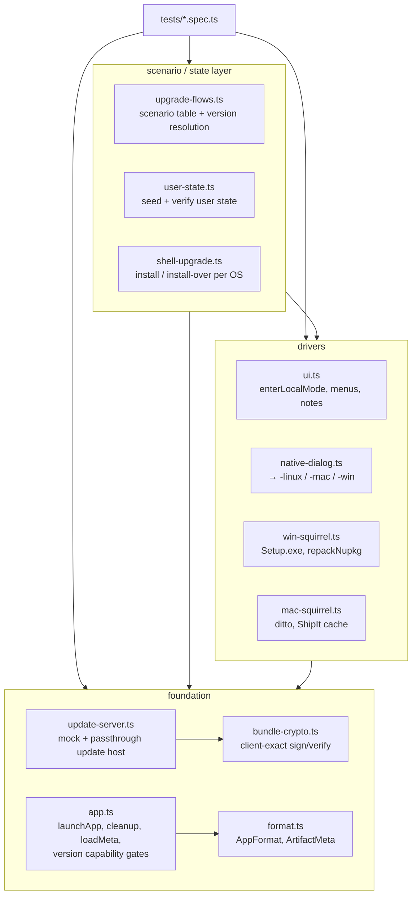

# Architecture: launching, attaching, isolating

## Why not Playwright's Electron launcher

Published Mimiri builds ship with the Node `--inspect` flags fused off.
`_electron.launch()` needs the Node inspector, so it can't attach — and without
it there is no main-process or Electron-API access from tests. Consequences:

- The app is attached **browser-side only**, over CDP.
- Native dialogs cannot be stubbed via `dialog` API overrides; they are driven
  **for real** per OS ([native-dialogs.md](native-dialogs.md)).
- Anything main-process (update state, bundle config) is asserted **from the
  outside**: files on disk, process lists, installer layouts.

## launchApp: the attach flow

`helpers/app.ts` → `launchApp(opts)` is the single entry point every spec uses.

Key options:

- `version` / `format` — which artifact to run; defaults resolve through
  `MIMIRI_VERSION` / `APP_FORMAT` env, then `artifacts/current.json`.
- `executablePath` — launch an installed copy (e.g. a Squirrel install under
  `%LOCALAPPDATA%`) instead of the extracted artifact.
- `env` — extra environment; an **empty-string value means "unset this var"**
  for the app (used e.g. to strip `GTK_USE_PORTAL`).
- `homeIsolation` — see below.

`cleanup(ctx, {keepUserData?})` closes the CDP connection, kills the process
tree (`flatpak kill` / `taskkill /T /F` / SIGKILL per format), and removes the
temp data dir unless a multi-launch flow needs it kept.

Beware: `ELECTRON_RUN_AS_NODE=1` leaks from VSCode-descended shells and makes
the app start as plain Node ("bad option" on Chromium flags). `launchApp` and
`run-with-dialogs.sh` unset it; do the same for any manual launch.

## Profile isolation

Two directory layouts exist, and they are **not interchangeable**:

| Layout   | How                                                                                | Requires                              |
| -------- | ---------------------------------------------------------------------------------- | ------------------------------------- |
| **flag** | `--user-data-dir=<tmpdir>`; data lands directly in the dir                         | client ≥ 2.6.6                        |
| **home** | fake `$HOME`; app derives real-user paths (`~/.mimiri` + `~/.config/mimiri-notes`) | env-based redirect works (Linux only) |

Notes live in **IndexedDB inside the Chromium profile**, not under `.mimiri`
(that holds `settings.config` and downloaded bundles). A profile only carries
across the 2.6.6 boundary in a chain if **both** shells use the home layout —
mixing layouts across a hop loses the notes.

Per-platform reality:

- **Linux** — both layouts work. Pre-2.6.6 shells need `HOME` redirected too
  (not just `XDG_CONFIG_HOME`), or they touch the machine's real `~/.mimiri`.
  Snap confines `/tmp` and excludes dotfiles via the home interface, so its
  data dirs must be non-hidden paths under `$HOME`.
- **Windows** — no env-based home isolation: Electron resolves home/appData
  through Win32 APIs that ignore `USERPROFILE`/`APPDATA` overrides (state
  splits between fake and real profile, or the app crashes silently).
  Pre-2.6.6 shells on Windows also keep downloaded bundles **next to the
  install** (`resources\bundles`), not in the profile.
- **macOS** — no env-based home isolation either: the app's "Mimiri Notes Key"
  lives in the per-user **login keychain**, which securityd resolves
  independently of `$HOME`; a fake HOME wedges boot on a "Keychain Not Found"
  modal.

So pre-2.6.6 chains on Windows/macOS run against the machine's **real profile**,
wiped around the run (`wipeRealProfile`, including the keychain item on mac),
gated behind `MIMIRI_REAL_PROFILE=1` — only ever set on disposable machines.
`launchApp({homeIsolation: true})` **throws** on win/mac unless the target dir
is the real home, precisely to make this explicit.

## Helper layering

- **`app.ts`** is the foundation: launcher, artifact metadata (`loadMeta`), the
  `getTestInfo` seam reader, and the capability gates specs skip on.
- **`update-server.ts` + `bundle-crypto.ts`** are the fake update host
  ([update-testing.md](update-testing.md)).
- **`ui.ts`** wraps the client's `data-testid` conventions and hides the
  macOS-native-menu vs DOM-titlebar difference.
- **`upgrade-flows.ts` / `user-state.ts` / `shell-upgrade.ts`** form the
  scenario engine for release validation ([upgrade-flows.md](upgrade-flows.md)).

## Version capability gates

Published builds differ; specs probe `meta.version` instead of assuming:

| Version | Capability                                           | Gate in `app.ts`                                                             |
| ------- | ---------------------------------------------------- | ---------------------------------------------------------------------------- |
| 2.6.5   | `APP_TEST_MODE=1` seam (`globalThis.mimiriTestInfo`) | `getTestInfo` returns undefined below                                        |
| 2.6.6   | `--user-data-dir` flag                               | `supportsUserDataDirFlag`                                                    |
| 2.6.9   | `MIMIRI_UPDATE_URL` / `MIMIRI_UPDATE_KEY` seams      | `supportsUpdateSeams`                                                        |
| 2.6.10  | clears Chromium cache in `activate()`                | (tests clear via CDP to also cover 2.6.9)                                    |
| 2.6.11  | bundle self-repair, missing-file 404s                | `supportsBundleRepair` (gates on 2.6.12 — the version that made it reliable) |
| 2.6.13  | store-install detection                              | `supportsStoreDetection`                                                     |

`SHELL_UPGRADE_BASE_VERSION = "2.6.9"` (first release with update seams) is the
pinned starting point for every shell-upgrade / external-install spec. If old
artifacts are ever pruned from the update host, move it forward.

## Package formats

`format.ts` defines `targz | flatpak | appimage | snap` (Linux; "targz" doubles
as the default on every OS). Format changes how the app is spawned and killed
(`flatpak run` + `--env=` flags, `snap run`, direct exe), where data dirs may
live (snap), and whether installs are machine-global (flatpak/snap — one
installed version at a time, installs are idempotent and re-entrant).
