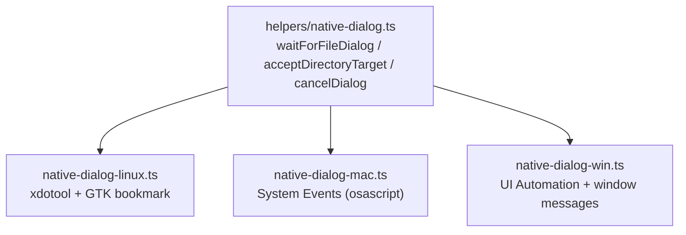

# Native dialogs: driving real file pickers

Because tests attach over CDP with no main-process access
([architecture.md](architecture.md)), Electron's `dialog` API cannot be
stubbed. `tests/export-import.spec.ts` therefore drives the **real** OS file
dialogs, through one façade with three per-OS backends:

`nativeDialogSupport()` is the skip guard — the spec self-skips where the
prerequisites below are missing.

## Linux — xdotool against GTK, in two delivery modes

GTK/Chromium decide **once per app process, at the first dialog**, whether the
file chooser is rendered by the xdg desktop **portal** (a separate
`xdg-desktop-portal-gtk` process, reached over D-Bus) or **in-process** GTK.
Anything that must influence that choice (`GTK_USE_PORTAL`, portal
reachability, a dead `DBUS_SESSION_BUS_ADDRESS`) must be in place before the
first dialog opens.

The spec runs both modes where the format allows: flatpak/snap are portal-only;
targz/appimage run a portal leg and an in-process-GTK leg (forced via a dead
D-Bus address). `isPortalDialog()` asserts the mode actually engaged
(`MIMIRI_EXPECT_PORTAL=0` relaxes this).

Driving mechanism: GTK directory choosers are unreliable under Xvfb (the
Ctrl+L location entry never commits). Instead, a temporary **GTK bookmark**
(`~/.config/gtk-3.0/bookmarks`, label `MIMIRI-E2E-TARGET`) is written _before_
the dialog opens; the driver finds the dialog window by WM_CLASS (portal) or
title hint, clicks the bookmark in the places sidebar (fixed offset — the
sidebar layout is identical in both modes), then clicks Select. Input is
XTEST via `xdotool`, which needs a window manager for focus.

**Environment**: dialog tests only work under `scripts/run-with-dialogs.sh`,
which builds a self-contained graphical session: Xvfb `:99`, openbox, a
_private_ D-Bus session, and its own portal pair (frontend + gtk backend),
gating readiness on both before tests start. Snap is the exception — a
confined snap can't reach a private bus, so the wrapper uses the real user
session bus. One-time provisioning: `scripts/setup-linux-dialogs.sh <format>`
(packages + a `portals.conf` forcing the gtk backend, since headless machines
have no `XDG_CURRENT_DESKTOP`).

## macOS — System Events against NSOpenPanel

Electron opens the panel as a **sheet** on the main window; the driver locates
it through the accessibility tree (`sheet 1 of window 1` of the process with
the app's pid) and navigates with the Go-to-Folder shortcut: Cmd+Shift+G →
type the absolute path → Return → Return.

Requires the Automation (→ System Events) and Accessibility TCC grants — for
SSH sessions these attribute to `sshd-keygen-wrapper`. `macDialogSupport()`
probes by attempting a keystroke. The same module exports
`clickNativeMenuItem`, which `ui.ts` uses for all macOS menu interaction (the
DOM titlebar doesn't exist there).

## Windows — UI Automation + window messages

The IFileDialog folder picker is an **owned** window (class `#32770`) nested
under the app's main window, not a desktop-root child. The driver finds the
app window first, then its `#32770` child, and takes that child's native
handle directly — walking Electron's huge accessibility subtree hangs UIA.

Input goes by handle, not keystrokes: UIA locates the picker's Win32 controls
(the "Folder:" edit, AutomationId 1152; Select Folder / Cancel, AutomationIds
1 / 2), then `WM_SETTEXT` sets the path and `BM_CLICK` presses the button —
independent of focus, foreground state, and keystroke timing. The obvious
alternative, UIA `ValuePattern`/`InvokePattern`, does **not** work here: the
picker's raw Win32 controls report no patterns to the managed UIA client
(probed on Windows 11 from both PowerShell 5.1 and pwsh — "Unsupported
Pattern"), even though the dialog's DirectUI elements do.

Needs an interactive desktop. SSH lands in session 0, which has none — on the
Windows test VM, dialog tests are delegated to the logged-in console session
via `scripts/run-in-console.ps1` (a schtasks-based relay that runs the command
in session 1 and streams back output and exit code).

## CI

All three GitHub runners provide interactive/automatable sessions, so the
dialog tests run **for real** in CI on every OS — Linux in both portal and
in-process modes, macOS without any TCC setup, Windows via UIA. Don't assume
they must skip there.
