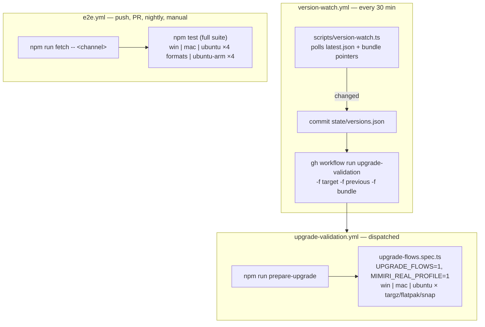

# Running the suite, and how CI is wired

## Local quick start

```sh
npm install
npm run fetch -- canary            # or: stable, or an explicit x.y.z
npm test
```

On Linux, pick a package format with `--format=targz|flatpak|appimage|snap`
(default targz), and run dialog-dependent specs under the session wrapper:

```sh
bash scripts/run-with-dialogs.sh npm test
```

One-time Linux provisioning for dialogs: `scripts/setup-linux-dialogs.sh <format>`.
The Electron sandbox also needs
`sudo sysctl -w kernel.apparmor_restrict_unprivileged_userns=0` (not
persistent across reboots).

## npm scripts

| Script | Does |
| --- | --- |
| `fetch` / `fetch:canary` | download + prepare an artifact (`scripts/fetch-artifact.ts`) |
| `prepare-upgrade` | fetch everything an upgrade-flow run needs (`--format=X`, `--scenario=id,id`) |
| `watch-versions` | dry-run of the version watcher (report only) |
| `test` / `test:headed` / `test:ui` | Playwright |
| `report` | open the HTML report |
| `clean` | remove `artifacts/`, `test-results/`, `playwright-report/` |
| `typecheck`, `format`, `format:check` | tsc / prettier |

## What fetch-artifact produces

`scripts/fetch-artifact.ts` resolves the channel/version from the production
`latest.json` feed (or builds the URL directly for an explicit version),
downloads into `artifacts/downloads/`, and prepares a runnable install:

- `artifacts/<version>/[<format>/]` — extracted app (Linux per-format subdirs)
  plus `meta.json` (version, channel, platform, format, executablePath, …).
  flatpak/snap are *installed* machine-globally instead (idempotent; the
  ostree commit / snap version is recorded and checked).
- `artifacts/<version>/bundle.json` — the version's published bundle, verified
  against the production public key (falls back to the channel pointer's
  bundle when no bundle matches the shell version — the two are separate
  streams).
- `artifacts/current.json` — `{version, format}`: what the tests will run.
  Override per run with `MIMIRI_VERSION` / `APP_FORMAT`.
- On Windows also the `Setup.exe`; and whenever version ≠ 2.6.9, the pinned
  `SHELL_UPGRADE_BASE_VERSION` archives too (for the shell-upgrade specs).

Gotcha: if you stage a **local build** under `artifacts/<ver>/` to test
unreleased changes, remove it once the real `<ver>` publishes —
`alreadyPrepared` sees the executable and silently keeps testing your local
build.

## The three workflows



- **e2e.yml** — the everyday suite. Matrix: windows-latest, macos-26,
  ubuntu-latest and ubuntu-24.04-arm each × {targz, flatpak, appimage, snap}.
  Linux legs apply the userns sysctl, run `setup-linux-dialogs.sh`, and wrap
  the test run in `run-with-dialogs.sh`. Channel defaults to canary. The
  nightly schedule runs with retries disabled (`MIMIRI_RETRIES=0`) so timing
  races surface there instead of being absorbed as retry-passes.
- **version-watch.yml** — polls the update host every 30 minutes, appends new
  versions to the per-channel history in `state/versions.json` (newest-first,
  capped at 20), commits as `version-watch[bot]`, and dispatches
  upgrade-validation with the resolved target/previous/bundle. This committed
  history is what makes the upgrade scenarios' `previous` selectors resolvable
  — the update host itself doesn't expose history.
- **upgrade-validation.yml** — runs `tests/upgrade-flows.spec.ts` on a reduced
  matrix (no arm64, no appimage) with `UPGRADE_FLOWS=1` and
  `MIMIRI_REAL_PROFILE=1` (runners are disposable). Also manually
  dispatchable with explicit `target`/`previous`/`bundle`/`scenario` inputs.

Manual dispatch: `gh workflow run e2e --ref <branch>`.

Shell scripts need their executable bit **committed**
(`git update-index --chmod=+x`) or they break on CI checkouts;
`run-with-dialogs.sh` also re-execs itself via `bash "$0"` so a missing bit
can't break it again.

## Key environment variables

| Var | Meaning |
| --- | --- |
| `MIMIRI_VERSION` / `APP_FORMAT` | which artifact to run (else `artifacts/current.json`) |
| `APP_TEST_MODE=1` | set by launchApp; enables the test seam (client ≥ 2.6.5) |
| `MIMIRI_UPDATE_URL` / `MIMIRI_UPDATE_KEY` | update-host seams (client ≥ 2.6.9); passthrough runs pass only the URL |
| `UPGRADE_FLOWS=1` | opt into upgrade-flow specs |
| `MIMIRI_SCENARIO` | comma-separated scenario id filter |
| `MIMIRI_TARGET_VERSION` / `MIMIRI_PREVIOUS_VERSION` / `MIMIRI_TARGET_BUNDLE` | version overrides for upgrade flows |
| `MIMIRI_REAL_PROFILE=1` | allow destructive real-profile scenarios (disposable machines only) |
| `MIMIRI_FAKE_STORE` | fake install source for store-managed update UI tests |
| `MIMIRI_RETRIES` | overrides Playwright retries (nightly CI sets 0 to surface races) |
| `MIMIRI_EXPECT_PORTAL=0` | relax the Linux portal-dialog assertion |

## Test machines (for cross-OS work from this repo)

Documented in detail in [CLAUDE.md](../CLAUDE.md#machines); in short:

- **this Linux box** — headless Ubuntu 24.04, fully provisioned.
- **`ssh macvm`** — disposable macOS arm64 VM, the default macOS target; full
  suite verified green, safe for real-profile scenarios.
- **`ssh mac`** — shared macOS machine, fallback only; never real-profile.
- **`ssh win`** — disposable Windows 11 VM; dialog tests need delegation to
  the console session via `scripts/run-in-console.ps1`.
