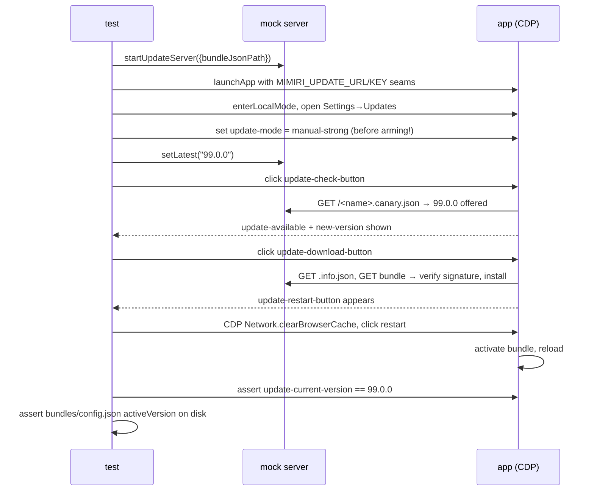

# Update testing: the mock update host

Mimiri has **two separate update streams**:

- **Bundle updates** — the web app (Vue renderer) shipped as a signed JSON
  bundle of assets; downloaded and activated by the running shell without
  reinstalling anything. Bundles live at
  `update.mimiri.io/2024101797F6C918.<version>.json`.
- **Shell updates** — the Electron binary itself, delivered per platform
  (Squirrel.Windows nupkg, Squirrel.Mac zip, or "go download the new package"
  on Linux).

Update tests never touch production. Clients ≥ 2.6.9 accept two env seams:
`MIMIRI_UPDATE_URL` (point at a local server) and `MIMIRI_UPDATE_KEY` (trust a
test signing key). Test-mode clients also skip all update checks unless
`MIMIRI_UPDATE_URL` is set, so even unseamed runs can't reach production.

## Two server flavors

`helpers/update-server.ts` implements both:

|           | `startUpdateServer`                                                                                     | `startPassthroughUpdateServer`                                                    |
| --------- | ------------------------------------------------------------------------------------------------------- | --------------------------------------------------------------------------------- |
| Used by   | `tests/update*.spec.ts`                                                                                 | `tests/upgrade-flows.spec.ts`                                                     |
| Serves    | the artifact's real bundle **transformed** to version 99.0.0 and re-signed with a fresh per-run RSA key | real production-signed bundles/installers **byte-for-byte**                       |
| Env seams | `MIMIRI_UPDATE_URL` + `MIMIRI_UPDATE_KEY`                                                               | `MIMIRI_UPDATE_URL` **only** — the client's baked-in production key must validate |
| Point     | exercise the update _mechanism_ against a version that can't collide with a real one                    | replay real version history under test control                                    |

Both start **disarmed** (the channel pointer offers `0.0.1`, so startup checks
are no-ops) and are armed per test with `server.setLatest(version)` — or
`setLatest(version, {hostUpdate: true})` to route the client down the
shell-installer path instead of the plain-bundle path, by setting the offered
version's `minElectronVersion` above any real shell.

Routes served (`<name>` = the signing-key name `2024101797F6C918`):

- `/<name>.<stable|canary>.json` — channel pointer (armed version or disarmed)
- `/<name>.<x.y.z>.json` — full signed bundle
- `/<name>.<x.y.z>.info.json` — size + `minElectronVersion` routing info
- `/latest.json` — download feed (installer links when a shell package is configured)
- `/electron-(win|darwin).<v>.json` — shell installer descriptor (RELEASES line, size, signature)
- `/<file>.(nupkg|zip)` — the installer bytes
- `/changelog.canary.json` — always answered (a 404 aborts the check mid-flight)

## Signing

`helpers/bundle-crypto.ts` reproduces the client's exact scheme:
RSASSA-PKCS1-v1_5 / SHA-256 over
`JSON.stringify({...bundle, signatures: undefined})`. The mock generates a
fresh RSA-3072 pair per run, signs, and **self-verifies with the client's own
verify path** before serving — so a serialization regression fails loudly in
the harness, not silently in the app. `PRODUCTION_UPDATE_PUBLIC_KEY` is used to
verify real bundles downloaded as fixtures before trusting them.

## The rename cascade (why the transform is nontrivial)

To make the update _observable_, the mock rewrites the baked version constant
inside the bundle's JS assets (it's a **template literal** `` `2.6.10` ``, not a
quoted string). But changing content behind an unchanged `app://` URL gets
served **stale from Chromium's HTTP cache** after activation — this bit twice
in real bugs (a stale main chunk; a cached lazy chunk importing the _old_ main
chunk, producing a double-booted app). Real builds never hit this because
content-hashed filenames change when content changes.

So the mock mimics a real build: every asset whose content changes is
**renamed** (its content-hash mutated), every referrer of a renamed file
changes content and therefore gets renamed too, cascading to a fixpoint
(~90 files). Tests additionally clear the Chromium cache over CDP before
activating, to cover clients < 2.6.10 (2.6.10+ clears it in `activate()`).

## The bundle update flow

## Shell update flows

- **Windows** — the in-app updater only works from a real Squirrel layout
  (`Update.exe` next to `app-<v>` under `%LOCALAPPDATA%\mimiri_notes`), so the
  test installs a published Setup.exe for real. The preferred payload is the
  fetched artifact's **own real nupkg**, updated to from the pinned base 2.6.9
  — Squirrel only trusts the SHA1 in the RELEASES line, which the mock
  computes from whatever file it serves and raw-signs, so a real package
  works as-is and the updated binary gets proven, not just the swap. When the
  fetched artifact _is_ the base, the payload falls back to the published
  nupkg **repacked** with a bumped nuspec version
  (`helpers/win-squirrel.ts::repackNupkg`, binaries unchanged) so the
  mechanism still runs.
- **macOS** — Squirrel.Mac validates the replacement app's **code signature**,
  so no repack is possible: the test updates between two real signed releases
  (pinned base 2.6.9 in a temp dir → the fetched artifact's zip). ShipIt swaps
  the `.app` in place; `helpers/mac-squirrel.ts` handles extraction (`ditto`),
  version probing (Info.plist) and ShipIt cache cleanup.
- **Linux** — there is no in-app shell updater; the app either points the user
  at a manual download (direct installs) or shows a store-managed notice
  (flatpak/snap, client ≥ 2.6.13). The actual upgrade paths are covered by the
  external-install and package-manager specs.

## Traps worth knowing (encoded in helpers/specs)

- The client's download step **re-fetches** `.info.json` for the offered
  version and routes on its `minElectronVersion` — a mock that 404s that route
  makes the update UI silently reset, presenting as a download timeout.
- **Disarm the mock (`setLatest(null)`) before relaunching after a shell
  update**: a pointer still offering the now-installed version reads as a
  pending _bundle_ of that version — a state no real host produces — and boot
  wedges in the update screen.
- `net::ERR_UNEXPECTED` on an `app://` URL on shells < 2.6.11 means **file
  missing on disk** at the active bundle path (the protocol handler had no 404) — not a network problem.
- The shell watchdog fires `loadURL()` if the renderer is quiet for 6 s; on slow
  machines that can land mid-activation and (pre-2.6.10) revive the cached
  pre-update page — the reason for the explicit CDP cache clear.
- When every bundle-**activating** spec fails with "element(s) not found" on
  the update-page testids right after a _successful_ activation, check the
  **version inside `artifacts/<ver>/bundle.json`**: the mock re-versions
  whatever bundle it's given, so a stale fixture (e.g. a 2.5.x bundle cached
  by an older fetch-artifact, which fell back to the stable pointer) activates
  fine but renders a pre-2.6.7 UI without the testids. Specs that never
  activate the served bundle (the shell-update ones) keep passing, which is
  the tell. Delete the file and re-fetch.
