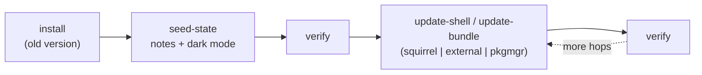
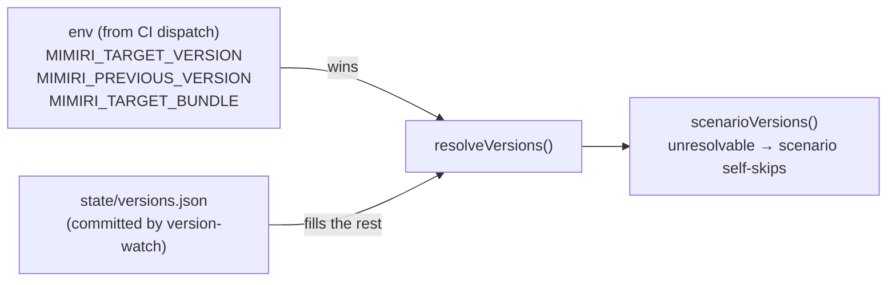

# Upgrade flows: validating a release against existing users

`tests/upgrade-flows.spec.ts` answers one question: **does the newly published
version break someone who already uses Mimiri?** Every scenario chains *real
published releases*: install an old one, create user state through the UI,
upgrade along a real-world path, and verify the state — after **every** hop.

It is opt-in (`UPGRADE_FLOWS=1`) and normally dispatched by CI when
version-watch detects a publish ([running-and-ci.md](running-and-ci.md)).

## Anatomy of a scenario

Scenarios are declarative `Step[]` chains in `helpers/upgrade-flows.ts`,
interpreted by the spec's `runStep`:



- **install** — `installShell` (extract/Setup.exe) or `installPackage`
  (flatpak/snap); pre-seam installs (< 2.6.9) get `preSeedPreSeamProfile` first
  (see below).
- **seed-state** — `helpers/user-state.ts`: a three-level note tree
  (`upgrade-root/-child/-grandchild`) with sentinel content, plus dark mode
  toggled via the View menu (persisted to `settings.config` — the one setting
  that reliably persists back to 2.6.1).
- **update-shell** — `via: "external"` (install-over from a website download),
  `via: "pkgmgr"` (flatpak/snap install of the newer package), or
  `via: "squirrel"` (the in-app updater, driven through the UI against the
  passthrough server, disarmed before relaunch).
- **update-bundle** — in-app bundle update to a specific real bundle version.
- **verify** — all three notes present and content intact, theme still dark,
  expected bundle active, and the app still *functional* (creates and fills a
  fresh `post-upgrade` note), process alive.

## The scenario table

| id | chain | platforms/formats |
| --- | --- | --- |
| `previous-to-target-external` | previous release → install-over → target | targz, all desktop OS |
| `stable-to-target-external` | current stable → install-over → target | targz |
| `ancient-2.5.72-to-target-external` | wild ancient version → install-over → target | targz, all desktop OS |
| `ancient-2.6.1-to-target-external` | wild ancient version → install-over → target | targz, linux + win only (no 2.6.1 mac build) |
| `previous-to-target-squirrel` | previous → in-app Squirrel shell update → target | win + mac |
| `bundle-chain` | target shell + previous bundle → in-app bundle update → latest bundle | targz (bundle updater is format-independent) |
| `previous-to-target-pkgmgr-flatpak` | previous flatpak → flatpak install → target | linux/flatpak |
| `previous-to-target-pkgmgr-snap` | previous snap → snap install → target | linux/snap |

`ANCIENT_WILD_VERSIONS` (2.5.72, 2.6.1) tracks versions actually still in the
install population per telemetry — update the list as it moves.

## Version resolution

Scenarios never name concrete versions; they use **selectors** (`target`,
`previous`, `stable`, `bundle-latest`, `bundle-previous`, `pin`) resolved at
run time:



The update host doesn't expose version history, which is why
`scripts/version-watch.ts` accumulates it into `state/versions.json` on a CI
schedule — without that file, `previous`/`bundle-previous` are unresolvable.

## The passthrough server

Everything is served **production-signed** via `startPassthroughUpdateServer`:
only `MIMIRI_UPDATE_URL` is passed, never `MIMIRI_UPDATE_KEY` — the client's
baked-in key must validate what it downloads, exactly as in production. The
server just lets the test *choose which real version is offered when*.

## Profile layouts and the pre-2.6.6 problem

A scenario whose chain contains any pre-2.6.6 shell must use the **home**
layout for the whole chain (old shells have no `--user-data-dir`; and mixing
the flag layout and the home layout across a hop loses the notes, because they
are different directory shapes — see
[architecture.md](architecture.md#profile-isolation)).

- On **Linux** the home layout is a fake `$HOME` — fully isolated.
- On **Windows/macOS** env-based home isolation does not work, so pre-2.6.6
  chains run against the machine's **real profile**, wiped before and after
  (`wipeRealProfile`, including the "Mimiri Notes Key" login-keychain item on
  mac). This is destructive and gated behind `MIMIRI_REAL_PROFILE=1` — only
  set it on disposable machines (CI runners, test VMs).

## Pre-seam clients need a pre-seeded profile

Pre-2.6.9 clients can't be pointed at the mock, and their
`checkUpdateInitial()` has **no updateMode gate**: on a profile whose
`lastRunHostVersion` differs from the running shell, they download and activate
whatever the production channel pointer offers — even a *downgrade*. So
installs of old versions pre-seed what a real existing user's profile contains:

```json
{ "updateMode": "off", "lastRunHostVersion": "<installed version>" }
```

(`preSeedPreSeamProfile` in `helpers/user-state.ts`.)

## Running it locally

```sh
npm run prepare-upgrade -- --format=targz   # fetch every artifact the scenarios need
UPGRADE_FLOWS=1 npx playwright test tests/upgrade-flows.spec.ts
```

- `MIMIRI_SCENARIO=id,id` filters the table.
- `MIMIRI_TARGET_VERSION` / `MIMIRI_PREVIOUS_VERSION` / `MIMIRI_TARGET_BUNDLE`
  override the versions; otherwise `state/versions.json` supplies them.
- Missing artifacts make a scenario self-skip with a hint, not fail.
- flatpak/snap installs are machine-global; the runner (re)installs the
  starting version itself, so runs are re-entrant.
- `bundle-chain` self-skips while the target's embedded base bundle is < 2.6.9
  (an old *active* bundle is what consumes `MIMIRI_UPDATE_URL`).
